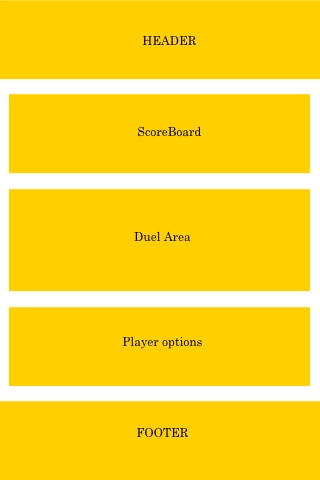
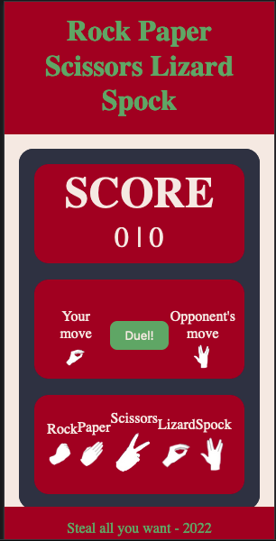
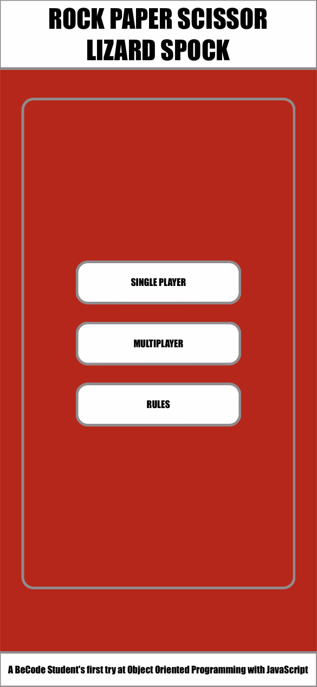
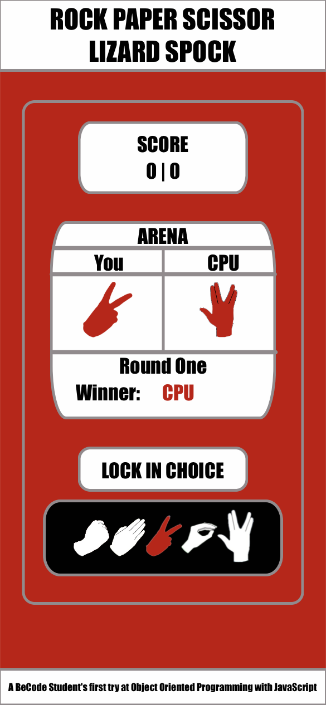
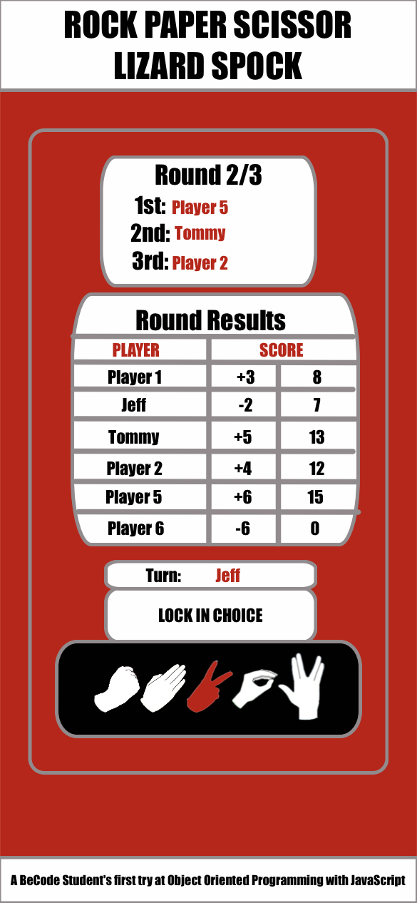

## Rock Paper Scissors Lizard Spock ##
A learning challenge project for the BeCode full stack web developper course.
[Check out the website here!](https://yasserb94.github.io/JS_Game_RockPaperScissors/)

### Objective ###
Make a JavaScript game of rock paper scissors including the big bang theory's rules of lizard spock
```
Rock Papers Scissors will be refered to as RPS in this readme
```
### The Rules ###
The classic RPS game has over 50% chance of resulting in a tie.
These rules add a Lizard and a Spock to the game to decrease the odds of having a tie.

|**CHOICE**|**BEATS**|**LOSES TO**|
|---|:---:|:---:|
|**ROCK**|Scissor Lizard|Paper Spock|
|**PAPER**|Rock Spock|Scissors Lizard|
|**SCISSOR**|Paper Lizard|Rock Spock|
|**LIZARD**|Paper Spock|Scissors Rock|
|**SPOCK**|Rock Scissors|Paper Lizard|

### Must have features ###
- [ ] Player gets to choose their move
- [ ] Computer to play against
- [ ] A way to start a new game
- [ ] A way to indicate the winner
      *Alert boxes are not allowed*

### Optional Features ###
- [ ] Nice graphics ?
- [ ] A text field for player input
- [ ] Indicator for the player's choice
- [ ] More options ?
- [ ] Complex rules ?
- [ ] Responsive Design

## Roadmap ##
#### Create a basic website to house the game ####
- [x] Use the mobile first approach
- [x] Have a container for the player's choice
    - [x] Have a container for the locked choice
    - [x] Have a container for the choices buttons
- [x] Have a container to display the computer's choice
- [x] Have a sketch for the start of the site



- [X] Recreate design in HTML
- [X] Add some basic styling
- [X] Add DOM elements for the choices, scoreboard, computer's score.



- [X] Create a player class
    - [X] Setter for playermove
    - [X] Getter for player move
- [X] Create a computer class
    - [X] Setter/getter for difficulty
    - [X] Setter/getter for chosen move
- [X] Add a 'duel arena' class
    - [X] check player move, compare it to computer move
- [ ] Create the controller
    - [x] Initialise the players
    - [x] Initialise the computers
    - [ ] Initialise the arena
    - [ ] Link dom elements in the controller
    - [ ] Update dom with new info
- [ ] Create a proper webpage to house the game
    - [ ] An intro game where people can choose between single and multiplayer



        - [ ] Single Player



            - [ ] The player specifies their name
            - [ ] Chooses the amount of bots he would like to add to the game
            - [ ] Button to start the game 
            - [ ] Player gets to lock in their choice
            - [ ] Press the duel button to calculate score
        - [ ] Multiplayer



            - [ ] The player gets to choose howmany players he is with
            - [ ] The player has the option to add extra bots
            - [ ] The player can pick wether he would like to specify player names
                - [ ] If So, ask names 1 by 1
                - [ ] If not generic names, player1,2,3,... are generated
            - [ ] Start game button
            - [ ] players pick move 1 by 1, have an indicator of who's turn it is
            - [ ] After the last player selected their will be a duel button
            - [ ] Once its pressed scores get calculated
                - [ ] For every player they win against they get 1 point
                - [ ] For every player they lose against they lose 1 point
            - [ ] Round score changes will be showed
            - [ ] Eventual winner 1st place will be showed
    - [ ] A rules button that overlays a table with the rules
    ## Personal Optional Goals ##
- [ ] Add best out of 3 with a scoreboard
- [ ] Enable a difficulty level
- [ ] Give the AI a random name
    *You are playing against Ze Master Bleeper*
- [ ] Add a multiplayer option
    - [ ] Multiple players can be created and the players will select their options once by one by receiving the device and pick ready
    - [ ] Allow computers to be added to the multiplayer game
    - [ ] The players can set their names in a pool
    - [ ] The players will play against each other in a group
    - [ ] The winning players continue until one RPS Master remains 'The Sheldonator'
